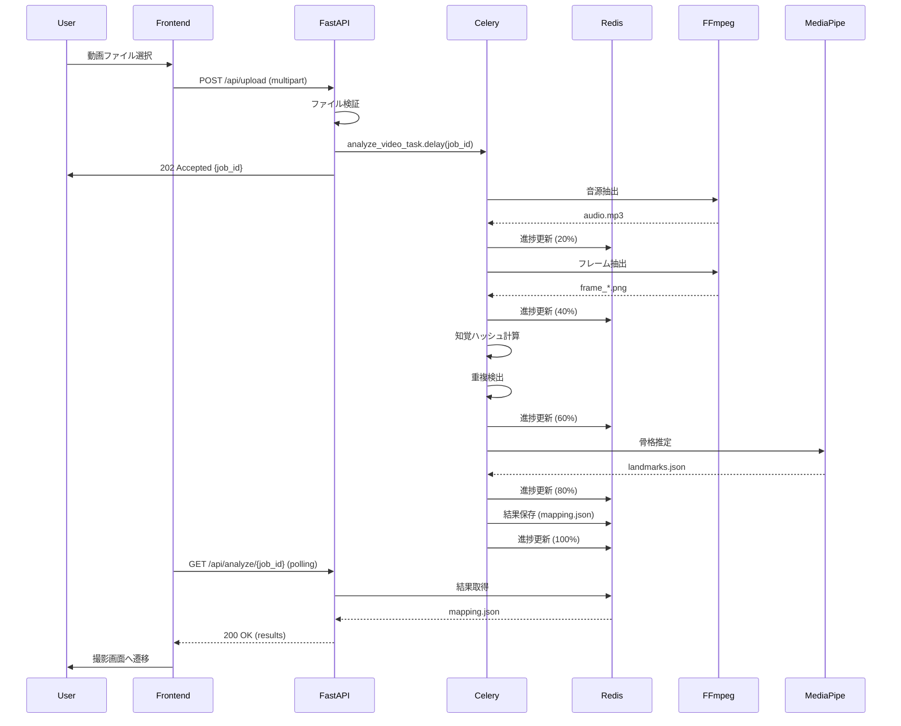
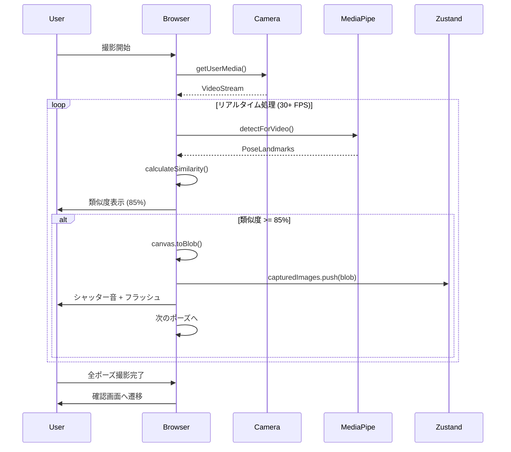
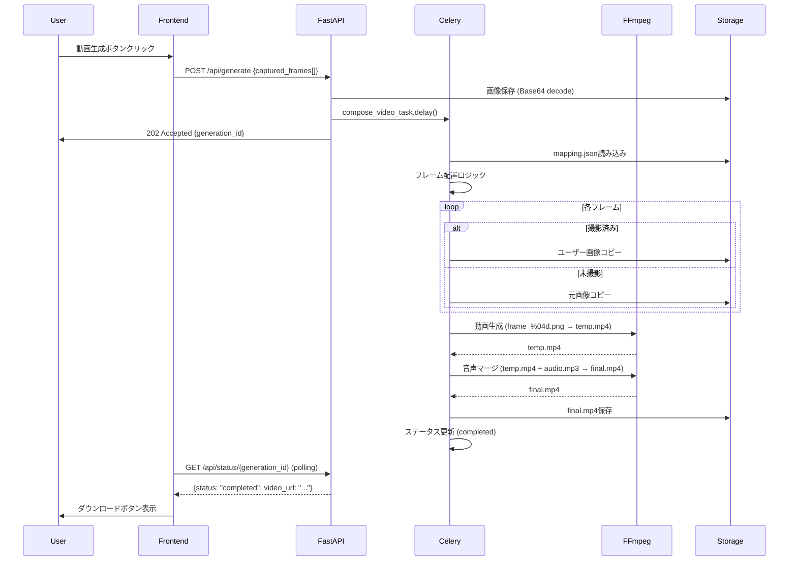

# DanceFrame - アーキテクチャ設計書

**最終更新**: 2025-11-16
**バージョン**: 2.0

---

## 📋 目次

1. [システム概要](#システム概要)
2. [アーキテクチャパターン](#アーキテクチャパターン)
3. [コンポーネント設計](#コンポーネント設計)
4. [データフロー](#データフロー)
5. [インフラストラクチャ](#インフラストラクチャ)
6. [スケーラビリティ戦略](#スケーラビリティ戦略)
7. [セキュリティアーキテクチャ](#セキュリティアーキテクチャ)

---

## 🏛️ システム概要

### アーキテクチャスタイル

**マイクロサービス志向のモノリシック・アーキテクチャ**

- **Frontend**: ステートフルSPA（Single Page Application）
- **Backend**: 非同期タスク処理を備えたRESTful API
- **Message Broker**: Celeryによるジョブキュー
- **Storage**: 揮発性ファイルストレージ（24時間保持）

### 設計原則

1. **関心の分離（Separation of Concerns）**
   - Frontend: UI/UX、リアルタイム処理
   - Backend: CPU集約的処理、データ永続化

2. **非同期処理優先**
   - ユーザーを待たせない（即座にレスポンス）
   - 重い処理はバックグラウンドで実行

3. **ステートレス設計**
   - APIサーバーは状態を持たない
   - 状態はRedisに集約

4. **フェイルセーフ**
   - タイムアウト設定
   - リトライ機構
   - エラーログ収集

---

## 🎨 アーキテクチャパターン

### レイヤードアーキテクチャ（Backend）

```
┌─────────────────────────────────────┐
│   Presentation Layer (FastAPI)     │  ← HTTP/WebSocket
├─────────────────────────────────────┤
│   Application Layer (Routers)      │  ← ビジネスロジック調整
├─────────────────────────────────────┤
│   Domain Layer (Services)          │  ← コアロジック
├─────────────────────────────────────┤
│   Infrastructure Layer             │  ← 外部依存（Redis, FFmpeg）
└─────────────────────────────────────┘
```

### Flux風状態管理（Frontend）

```
┌─────────┐    Action     ┌─────────┐
│  View   │ ──────────▶  │  Store  │
│ (React) │               │(Zustand)│
└────▲────┘               └────┬────┘
     │                         │
     └─────── State Update ────┘
```

---

## 🧩 コンポーネント設計

### Frontend コンポーネント階層

```
App (Next.js App Router)
├── Layout
│   ├── Header
│   └── Footer
│
├── Pages (Routes)
│   ├── / (Upload)
│   │   └── FileUploader
│   │
│   ├── /analysis (Analysis)
│   │   └── ProgressBar
│   │
│   ├── /prepare (Prepare)
│   │   └── PoseThumbnailGrid
│   │
│   ├── /capture (Capture)
│   │   ├── CameraView
│   │   ├── PoseOverlay
│   │   ├── SimilarityMeter
│   │   └── Timer
│   │
│   ├── /review (Review)
│   │   └── ThumbnailGrid
│   │
│   ├── /generate (Generate)
│   │   └── GenerationProgress
│   │
│   └── /download (Download)
│       └── VideoPlayer
│
├── Hooks
│   ├── useMediaPipe
│   ├── useCamera
│   ├── usePoseSimilarity
│   └── useAudio
│
├── Lib
│   ├── poseComparison
│   ├── api (Axios client)
│   └── constants
│
└── Store (Zustand)
    └── useAppStore
        ├── job metadata
        ├── unique frames
        ├── captured images
        └── UI state
```

### Backend サービス階層

```
FastAPI Application
├── Routers (エンドポイント)
│   ├── upload.py        # POST /api/upload
│   ├── analyze.py       # GET  /api/analyze/{job_id}
│   ├── generate.py      # POST /api/generate
│   └── download.py      # GET  /api/download/{job_id}/final.mp4
│
├── Services (ビジネスロジック)
│   ├── frame_extractor.py     # FFmpegラッパー
│   ├── hash_analyzer.py       # imagehash処理
│   ├── pose_estimator.py      # MediaPipe処理
│   ├── video_composer.py      # 動画合成
│   └── file_validator.py      # ファイル検証
│
├── Tasks (Celery Workers)
│   ├── video_analysis.py      # 解析タスク
│   └── video_composition.py   # 合成タスク
│
├── Models (Pydantic)
│   ├── analysis.py            # AnalysisResult, UniqueFrame
│   ├── generation.py          # GenerationRequest, GenerationResult
│   └── common.py              # BaseModel拡張
│
└── Utils
    ├── redis_client.py        # Redis操作
    ├── file_handler.py        # ファイルI/O
    └── logger.py              # ログ設定
```

---

## 🔄 データフロー

### 1. アップロード→解析フロー



### 2. 撮影フロー（クライアント側）



### 3. 動画生成フロー



---

## 🏗️ インフラストラクチャ

### デプロイメント構成（本番環境）

```
┌─────────────────────────────────────────────────────┐
│                   Internet                          │
└────────────────────┬────────────────────────────────┘
                     │
          ┌──────────┴──────────┐
          │                     │
    ┌─────▼─────┐        ┌─────▼─────┐
    │  Vercel   │        │  Railway  │
    │ (CDN+SSR) │        │  (VPS)    │
    └─────┬─────┘        └─────┬─────┘
          │                    │
    ┌─────▼──────────┐   ┌─────▼──────────┐
    │  Next.js 16    │   │  FastAPI       │
    │  - Static HTML │   │  - Uvicorn     │
    │  - API Routes  │   │  - Gunicorn    │
    │  - SSR         │   │  (4 workers)   │
    └────────────────┘   └────┬───────────┘
                              │
                    ┌─────────┼─────────┐
                    │         │         │
              ┌─────▼────┐ ┌─▼──────┐ ┌▼────────┐
              │ Celery   │ │ Celery │ │ Redis   │
              │ Worker 1 │ │Worker 2│ │ (Cache) │
              │          │ │        │ │         │
              │ FFmpeg   │ │ FFmpeg │ │ Queue   │
              │ MediaPipe│ │MediaPipe│ │ Results │
              └──────────┘ └────────┘ └─────────┘
```

### ローカル開発環境

```
┌────────────────────────────────────────┐
│         Docker Compose                 │
│                                        │
│  ┌──────────┐  ┌──────────┐           │
│  │ Frontend │  │ Backend  │           │
│  │ :3000    │  │ :8000    │           │
│  └────┬─────┘  └────┬─────┘           │
│       │             │                 │
│  ┌────▼─────────────▼─────┐           │
│  │    Celery Worker       │           │
│  │    (2 concurrency)     │           │
│  └────┬───────────────────┘           │
│       │                               │
│  ┌────▼─────┐                         │
│  │  Redis   │                         │
│  │  :6379   │                         │
│  └──────────┘                         │
│                                        │
│  Volumes:                              │
│  - backend_uploads                     │
│  - backend_outputs                     │
│  - redis_data                          │
└────────────────────────────────────────┘
```

---

## 📈 スケーラビリティ戦略

### 水平スケーリング

#### Celery Worker

```yaml
# docker-compose.prod.yml

services:
  celery-worker:
    image: danceframe-backend:latest
    deploy:
      replicas: 4  # 4つのワーカーインスタンス
      resources:
        limits:
          cpus: '2'
          memory: 4G
```

**効果:**
- 並列処理数: 4ワーカー × 2並列 = 8タスク同時処理
- スループット: 8タスク/分 → 32タスク/分（4倍）

#### Redis（将来的）

```
┌─────────────┐
│ Redis       │
│ Primary     │
└──────┬──────┘
       │
   ┌───┴───┐
   │       │
┌──▼──┐ ┌──▼──┐
│Replica│ │Replica│
│  1    │ │  2    │
└───────┘ └───────┘
```

### 垂直スケーリング

| コンポーネント | 現在 | 拡張後 |
|------------|------|-------|
| **FastAPI** | 1 vCPU, 1GB RAM | 2 vCPU, 2GB RAM |
| **Celery Worker** | 2 vCPU, 4GB RAM | 4 vCPU, 8GB RAM |
| **Redis** | 512MB | 2GB |

### キャッシング戦略

#### 1. CDNキャッシュ（Frontend）

```javascript
// next.config.js

module.exports = {
  async headers() {
    return [
      {
        source: '/static/:path*',
        headers: [
          {
            key: 'Cache-Control',
            value: 'public, max-age=31536000, immutable',
          },
        ],
      },
    ];
  },
};
```

#### 2. Redisキャッシュ（Backend）

```python
# キャッシュ戦略

# ジョブ結果（24時間）
SET job:{job_id}:result "{json}" EX 86400

# 生成結果（24時間）
SET gen:{gen_id}:result "{json}" EX 86400

# セッション（1時間）
SET session:{session_id} "{data}" EX 3600
```

---

## 🔒 セキュリティアーキテクチャ

### 多層防御（Defense in Depth）

```
┌─────────────────────────────────────────┐
│  Layer 1: Network (Firewall/CDN)       │  ← DDoS対策
├─────────────────────────────────────────┤
│  Layer 2: Application (Rate Limiting)  │  ← 10 req/min/IP
├─────────────────────────────────────────┤
│  Layer 3: Validation (Input Check)     │  ← ファイルタイプ検証
├─────────────────────────────────────────┤
│  Layer 4: Execution (Sandbox)          │  ← FFmpeg制限
├─────────────────────────────────────────┤
│  Layer 5: Data (Encryption at Rest)    │  ← 将来的にS3暗号化
└─────────────────────────────────────────┘
```

### セキュリティヘッダー

```python
SECURITY_HEADERS = {
    "X-Content-Type-Options": "nosniff",
    "X-Frame-Options": "DENY",
    "X-XSS-Protection": "1; mode=block",
    "Strict-Transport-Security": "max-age=31536000; includeSubDomains",
    "Content-Security-Policy": "default-src 'self'; script-src 'self' 'unsafe-inline' https://cdn.jsdelivr.net; style-src 'self' 'unsafe-inline'; img-src 'self' data: blob:; media-src 'self' blob:;"
}
```

### CORS設定

```python
# FastAPI CORS設定

app.add_middleware(
    CORSMiddleware,
    allow_origins=[
        "http://localhost:3000",
        "https://danceframe.app"
    ],
    allow_credentials=True,
    allow_methods=["GET", "POST", "PUT", "DELETE"],
    allow_headers=["*"],
    max_age=3600,
)
```

---

## 📊 監視・ロギング

### ログレベル

| Level | 用途 | 例 |
|-------|------|-----|
| **DEBUG** | 開発時の詳細情報 | MediaPipe初期化パラメータ |
| **INFO** | 正常な動作の記録 | ジョブ開始/完了 |
| **WARNING** | 潜在的な問題 | 骨格検出失敗（リトライ成功） |
| **ERROR** | 回復可能なエラー | FFmpegエラー（タスク失敗） |
| **CRITICAL** | システム停止レベル | Redis接続不可 |

### メトリクス収集（将来的）

```python
# Prometheus metrics

from prometheus_client import Counter, Histogram

# カウンター
uploads_total = Counter('danceframe_uploads_total', 'Total number of uploads')
generations_total = Counter('danceframe_generations_total', 'Total number of video generations')

# ヒストグラム
analysis_duration = Histogram('danceframe_analysis_duration_seconds', 'Analysis task duration')
generation_duration = Histogram('danceframe_generation_duration_seconds', 'Generation task duration')
```

---

## 🔧 技術的負債管理

### 既知の制約・妥協点

| 項目 | 現状 | 理想 | 優先度 |
|------|------|------|--------|
| **ストレージ** | 揮発性ローカル | S3/GCS | P1 |
| **認証** | なし | JWT + OAuth | P1 |
| **データベース** | Redisのみ | PostgreSQL | P2 |
| **監視** | ログのみ | Sentry + Datadog | P2 |
| **テスト** | 手動 | CI/CD自動テスト | P0 |

### リファクタリング計画

**Phase 1 (v1.1):**
- [ ] S3ストレージ移行
- [ ] JWT認証実装
- [ ] CI/CD構築

**Phase 2 (v2.0):**
- [ ] PostgreSQL導入
- [ ] Sentry統合
- [ ] Datadog APM

---

**Document Version**: 2.0
**Last Updated**: 2025-11-16
**Maintainer**: Kosuke Terada
